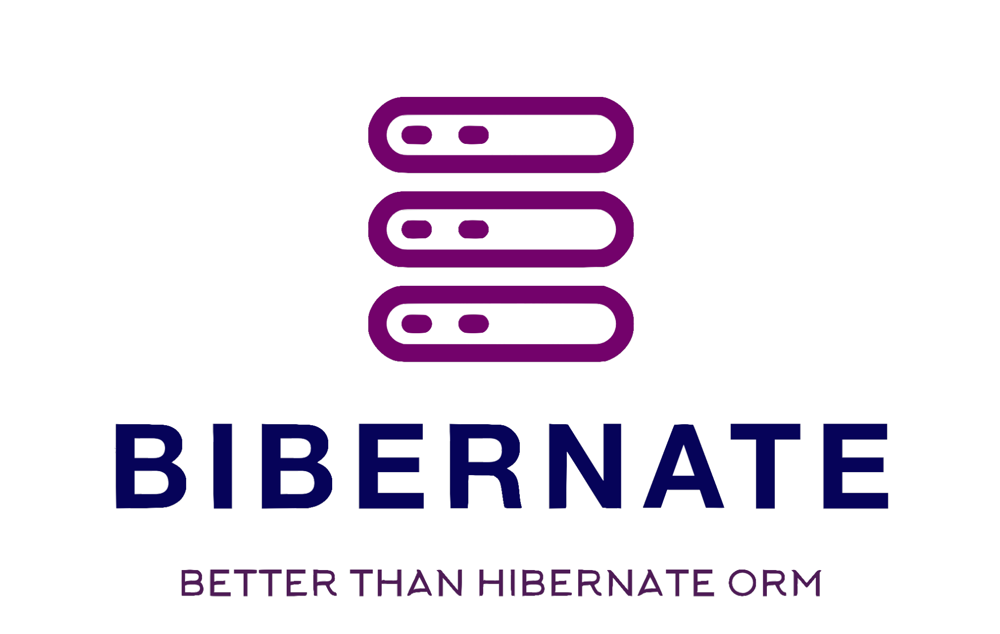

<p align="center">
    
</p>

*Bibernate* is a custom simplified Object-Relational Mapping framework. It helps to work with database in object-oriented manner.

## Main features
- Configuration
  - Read data source configuration from yaml file
  - Multiple persistence units are supported
  - Builds Hikari DataSource pool
- Mapping to provide metadata for ORM
- First level cache for session
- Dirty checking mechanism
- Transaction management
- CRUD operations supported by Entity repository

## Provided annotations
| Annotation     | Target   | Description                                                                                                                                |
|:---------------|:---------|:-------------------------------------------------------------------------------------------------------------------------------------------|
| `@Entity`      | `TYPE`   | *The annotation used to specify entity*                                                                                                    |
| `@Id`          | `TYPE`   | *The annotation used to mark primary key field of an entity. Each entity should contain exactly one field, annotated with such annotation* |
| `@Table`       | `TYPE`   | *The annotation used to specify a custom table name for an entity*                                                                         |
| `@Column`      | `FIELD`  | *The annotation used to specify a custom column name for a field of an entity*                                                             |
| `@ManyToOne`   | `FIELD`  | *The annotation is used to map many-to-one relationships with using reference types*                                                       |
| `@OneToMany`   | `FIELD`  | *The annotation is used to map bidirectional one-to-many relationships with using collection types*                                        |
| `@OneToOne`    | `FIELD`  | *The annotation is used to map one-to-one relationships with using reference types*                                                        |

## Get started
### Configure your environment
You should setup such tools:
- [Git](https://git-scm.com/)
- [JDK 17](https://www.oracle.com/java/technologies/javase/jdk17-archive-downloads.html)
- [Maven 3.6.3 (or higher)](https://maven.apache.org/)

## Build from source
#### 1. Clone the repository
To create application with usage of the Bibernate, you have to clone Bibernate source code repository [Bibernate](https://github.com/bobocode-blyznytsia/bibernate).
```shell
git clone git@github.com:bobocode-blyznytsia/bibernate.git
cd bibernate
```
#### 2. Build the Bibernate locally by using Maven
```shell
mvn clean install
```
#### 3. Add the Bibernate dependency into your project `pom.xml`
```xml
<dependencies>
    ...
    <dependency>
        <groupId>com.bobocode.blyznytsia</groupId>
        <artifactId>bibernate</artifactId>
        <version>${bibernate.version}</version>
    </dependency>
    ...
</dependencies>
```
The variable `bibernate.version` is the current version of Bibernate.
#### 4. Build your application by using maven
```shell
mvn clean install
```
### Basic usage
#### Configuration
To start the project with Bibernate you need to create configuration for your database first.
1. Create `persistence.yml` file with such structure:
```yaml
persistenceUnits:
  - name: h2
    dataSource:
      jdbcUrl: jdbc:h2:mem:testdb
      userName: sa
      password: password
      driverClassName: org.h2.Driver
```
2. Use the name of persistence unit in `DefaultSessionFactoryBuilder`.
```java
SessionFactoryBuilder sessionFactoryBuilder = new DefaultSessionFactoryBuilder("h2");
SessionFactory sessionFactory = sessionFactoryBuilder.createSessionFactory();
```
#### Session usage
1. You can create the `Session` from `SessionFactory` instance:
```java
Session session = sessionFactory.openSession();
```
2. To use transaction you can do:
```java
Transaction transaction = session.getTransaction();
transaction.begin();
// do some action
transaction.commit();
// for rollback you can use
transaction.rollback();
```
3. Session has number of method to work with Entity
- `void persist(Object entity)`:

  This method is used to persist an entity object to the database. The entity object passed as a parameter will be inserted into the database as a new record.
- `void remove(Object entity)`:

  This method is used to remove an entity object from the database. The entity object passed as a parameter will be deleted from the database.
- `<T> T find(Class<T> entityClass, Object primaryKey)`:

  This method is used to find an entity in the database by its primary key. The entity class and primary key value are passed as parameters, and the corresponding entity object is returned from the database.
- `void flush()`:
  
  This method is used to synchronize any changes made to the entities in the session with the database. Any pending changes in the session will be written to the database.
- `void close()`:

  This method is used to close the session and release any resources associated with it, such as database connections. After closing the session, no further operations can be performed on it.
- `boolean isOpen()`:

  This method is used to check if the session is currently open, i.e., if it has not been closed using the close() method.
- `Transaction getTransaction()`:

  This method is used to obtain the current transaction associated with the session.

#### Mapping example
Currently, mapping is supported only for read operations.
Default fetch type is `EAGER`.
```java
@Entity
@Table(name = "persons")
public class Person {

  @Id
  private Long id;

  private String firstName;

  private String lastName;

  private LocalDate birthday;
  
  private LocalDateTime createdAt = LocalDateTime.now();

  @OneToOne(mappedBy = "person")
  private Address address;
  
  @OneToMany(mappedBy = "person")
  private List<Note> notes = new ArrayList<>();
}

@Entity
@Table(name = "notes")
public class Note {

  @Id
  private Long id;

  private String body;

  @ManyToOne(joinColumnName = "person_id")
  private Person person;
}

@Entity
@Table(name = "addresses")
public class Address {

  @Id
  private Long id;

  private String city;

  private String street;

  @OneToOne(joinColumnName = "person_id")
  private Person person;

}
```

### Demo project
You can check the [bibernate-demo](https://github.com/bobocode-blyznytsia/bibernate-demo) project, which shows the features of Bibernate
